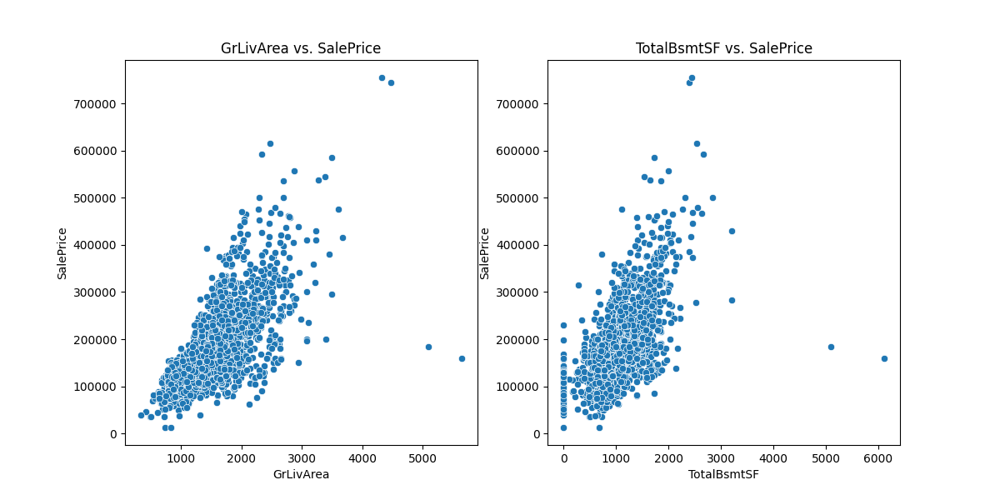

# Final Report: Predicting Ames Housing Prices

**Group Members:** Quan Gan
**Contribution Breakdown:** All work was completed by Quan Gan

---

## 1. Introduction

### 1.1. Background
The real estate market represents a significant and foundational component of both national and global economies. For individuals, a home is often the single largest investment they will ever make. For financial institutions, real estate assets form a substantial portion of their portfolios. Consequently, the accurate valuation of property is a task of paramount importance, underpinning critical decisions made by a diverse array of stakeholders. Homeowners rely on valuations for refinancing and sales, buyers for making competitive and fair offers, and financial institutions for underwriting mortgages and managing risk. The stability and transparency of the real estate market are, in many ways, contingent on the ability to determine property values with a high degree of confidence and objectivity.

### 1.2. The Challenge of Prediction
Historically, property valuation has been the domain of professional appraisers who use their expertise and knowledge of the local market to estimate a property's worth. This process, while valuable, often involves a degree of subjectivity and can be influenced by individual bias. Furthermore, manual appraisals are time-consuming and can be costly to scale. In an increasingly data-rich world, the limitations of these traditional methods have become more apparent. The advent of machine learning and advanced statistical modeling offers a powerful alternative. By leveraging large datasets containing dozens or even hundreds of property attributes, data-driven approaches can identify complex, non-linear patterns that are often invisible to the human eye. This allows for the creation of objective, repeatable, and highly accurate valuation models that can serve as powerful tools for market participants.

### 1.3. Introducing the Ames Dataset
To explore the potential of machine learning in this domain, this project utilizes the Ames Housing Dataset, a well-known and highly regarded benchmark in the field of applied machine learning. Compiled by Professor Dean DeCock of Truman State University, this dataset contains detailed information on 2,919 residential property sales in Ames, Iowa, between 2006 and 2010. Its richness lies in its breadth, encompassing 79 distinct features that describe virtually every aspect of a home—from quantitative measures like square footage and the number of bathrooms to qualitative attributes like the quality of the kitchen and the condition of the roof. This combination of size and feature diversity makes it an ideal testbed for developing and evaluating sophisticated regression models.

### 1.4. Project Goal & Scope
The primary goal of this project is twofold: first, to develop a robust and accurate machine learning model capable of predicting the final sale price of a residential property in Ames based on its features. Second, to analyze this model to identify and interpret the key drivers of property value in this market. The scope of our work encompasses the entire data science lifecycle: a thorough exploratory data analysis (EDA) to understand the data's underlying structure; a rigorous data preprocessing and feature engineering phase to prepare the data for modeling; the training and evaluation of multiple regression algorithms; and a detailed analysis and discussion of the final results, including model performance and feature importances.

### 1.5. Report Structure
This report documents our journey and findings in a structured manner. We begin by formally defining the problem and discussing its practical importance. We then provide a high-level narrative of our methodology before diving into a detailed technical exposition of our work, covering the EDA, data preparation, and modeling strategies. Subsequently, we present and discuss our results, comparing the performance of different models and analyzing the key features influencing house prices. The report concludes with a summary of our findings and offers suggestions for potential future work in this area.

---

## 2. Problem Statement

### 2.1. Formal Definition
The task at the core of this project is a **supervised regression problem**. In formal terms, the objective is to learn a mapping function `f` that takes a feature vector `X` (representing a property's attributes) as input and outputs a continuous value `y` (the predicted `SalePrice`).

-   **Input:** A feature vector `X = {x_1, x_2, ..., x_79}`, where each `x_i` is an attribute of a residential property in Ames (e.g., `GrLivArea`, `OverallQual`, `YearBuilt`).
-   **Output:** A continuous variable `y = SalePrice`, representing the final transaction price of the property in U.S. dollars.

The model will be trained on a labeled dataset where both the feature vectors and the corresponding sale prices are known. Its performance will be evaluated on its ability to generalize and make accurate predictions on unseen data.

### 2.2. Key Questions
This project seeks to answer several specific, critical questions:
1.  **Which property attributes are the most significant predictors of sale price?** Understanding the hierarchy of features is crucial for explaining the model's decisions and providing actionable insights to stakeholders.
2.  **How do different machine learning models compare in terms of predictive accuracy for this dataset?** We will evaluate a spectrum of models, from simple linear regressions to complex gradient boosting ensembles, to determine which architectural approach yields the best performance.
3.  **What is the expected error of the best predictive model?** We will quantify the model's accuracy using the Root Mean Squared Logarithmic Error (RMSLE), which provides an interpretable measure of the typical prediction error in percentage terms.

---

## 3. Importance of the Problem

An accurate and interpretable housing price prediction model provides immense practical value to various stakeholders across the real estate ecosystem:

-   **For Sellers and Buyers:** For sellers, an objective valuation model provides a data-driven baseline for setting a competitive and realistic listing price, potentially leading to a faster sale and maximizing returns. For buyers, it serves as a crucial due diligence tool, helping them to avoid overpaying and to make informed offers based on a property's intrinsic characteristics rather than market hype.

-   **For Real Estate Agents:** Agents equipped with such a tool can elevate their advisory services. Instead of relying solely on intuition and comparable sales, they can provide clients with data-backed insights, building trust and justifying their pricing strategies. This can lead to more effective negotiations and a stronger professional reputation.

-   **For Financial Institutions:** Banks and mortgage lenders are fundamentally in the business of risk management. An accurate valuation model is a critical component of their loan underwriting process. It allows them to verify that the collateral (the property) for a loan is sufficient, thereby reducing the risk of loss in the event of a default. At a portfolio level, these models can be used to assess and monitor the value of billions of dollars in real estate assets.

---

## 4. Your Work: A Methodological Overview

Our project followed a structured, multi-stage methodology, progressing logically from data exploration to final model interpretation.

### 4.1. Data Exploration
The project commenced with a comprehensive Exploratory Data Analysis (EDA). The initial goal was to develop an intuition for the dataset's structure, feature distributions, and inter-variable relationships. We paid special attention to the target variable, `SalePrice`, analyzing its statistical properties. This initial analysis confirmed that its distribution was heavily right-skewed, a common characteristic of price data. This finding immediately informed our preprocessing strategy, highlighting the need for a normalizing transformation to make the data more amenable to linear models.

### 4.2. Data Preparation
Following the EDA, we proceeded to the data preparation phase. This is a critical step, as the quality of the data directly impacts the performance of any machine learning model. Our work involved several key tasks: imputing a significant number of missing values using appropriate strategies (e.g., using the median for numerical features, the mode for categorical ones, or knowledge-based imputation); engineering new, more informative features from existing ones, such as `TotalSF` (total square footage) and `TotalBath` (total bathrooms), to capture holistic property characteristics and reduce dimensionality; and converting all categorical features into a numerical format using one-hot encoding, enabling the algorithms to process them.

### 4.3. Modeling and Evaluation
With a clean and well-structured dataset, we moved to the modeling phase. Our strategy was to train and evaluate a diverse set of regression models to understand the performance trade-offs between simplicity and complexity. This included regularized linear models (Ridge, Lasso) and powerful ensemble methods (Random Forest, XGBoost, LightGBM). To ensure our performance estimates were robust and not simply the result of a favorable train-test split, we employed a rigorous 5-fold cross-validation technique. The primary metric for evaluation was the Root Mean Squared Logarithmic Error (RMSLE), chosen for its sensitivity to relative errors, which is more appropriate for price prediction than absolute error.

---

## 5. Technical Details

### 5.1. Exploratory Data Analysis (EDA)
Our EDA provided several foundational insights that guided the entire project.

**SalePrice Distribution:** The initial histogram of `SalePrice` revealed a pronounced positive (right) skew. Many machine learning models, particularly linear ones, perform best when the target variable is normally distributed. A log transformation (`log(1 + x)`) was applied, which effectively corrected the skew and resulted in a distribution that closely approximates a normal distribution. This is a critical step for stabilizing variance and improving model performance.

*Figure 1: Distribution of SalePrice before (left) and after (right) log transformation.*

**Feature Correlations:** We computed a correlation matrix to analyze the linear relationships between the numerical features and `SalePrice`. The heatmap below shows the top 10 features most correlated with the target variable. `OverallQual` (Overall Quality) exhibits the strongest correlation, which is highly intuitive. Other features like `GrLivArea` (Above Grade Living Area) and `GarageCars` (Size of garage in car capacity) also show strong positive correlations, confirming that size and key amenities are major value drivers.

*Figure 2: Heatmap of correlations between `SalePrice` and the top 10 most correlated features.*

**Key Relationships:** Scatter plots further illuminated the relationship between `SalePrice` and key continuous variables. The plot for `GrLivArea` shows a clear, strong, positive linear trend: as living area increases, so does the sale price. The plot for `TotalBsmtSF` (Total square feet of basement area) shows a similar, albeit slightly less pronounced, positive trend. These plots also help identify potential outliers—properties that deviate significantly from the general trend.

*Figure 3: Relationship between SalePrice and key area-related features.*

### 5.2. Preprocessing & Feature Engineering
**Missing Value Imputation:** A detailed strategy was developed to handle missing data. For example, `LotFrontage` (Linear feet of street connected to property) was imputed using the median value for the property's neighborhood, based on the assumption that nearby houses have similar lot structures. For categorical features like `MasVnrType` (Masonry veneer type), missing values were filled with the mode ('None'), as this was the most common category.

**Feature Engineering:** To create more powerful predictive signals, we engineered two key features:
-   **`TotalSF`**: This was calculated as `TotalBsmtSF` + `1stFlrSF` + `2ndFlrSF`. This single feature provides a more holistic measure of a property's total living and basement space than the individual components.
-   **`TotalBath`**: This was calculated as `BsmtFullBath` + `0.5 * BsmtHalfBath` + `FullBath` + `0.5 * HalfBath`. This consolidates four separate features into a single, intuitive measure of a home's total bathroom facilities.

**Encoding:** Categorical variables were transformed using one-hot encoding. This method creates new binary (0 or 1) columns for each category within a feature, preventing the model from incorrectly assuming an ordinal relationship between categories (e.g., that 'Brick' is "greater" than 'Stone').

### 5.3. Models and Validation
We selected a range of models to cover different algorithmic approaches:
-   **Ridge & Lasso Regression:** These are linear models that introduce a penalty term to the loss function to prevent overfitting. Ridge uses an L2 penalty, while Lasso uses an L1 penalty which can also perform feature selection by shrinking some feature coefficients to zero.
-   **Random Forest:** An ensemble method that builds multiple decision trees and merges their predictions. It is robust to overfitting and can capture complex non-linear relationships.
-   **XGBoost & LightGBM:** These are implementations of gradient boosted decision trees, which build trees sequentially, with each new tree correcting the errors of the previous one. They are known for their state-of-the-art performance on tabular data.

The **Root Mean Squared Logarithmic Error (RMSLE)** was our primary evaluation metric. It is calculated as `sqrt(mean(square(log(p_i + 1) - log(a_i + 1))))`, where `p_i` is the prediction and `a_i` is the actual value. This metric is ideal because it measures the relative error (percentage difference) and heavily penalizes under-prediction, which is often more costly in business contexts.

---

## 6. Results & Discussion

### 6.1. Model Performance
The 5-fold cross-validation yielded clear results on the performance of each model. The table below summarizes the RMSLE scores for each fold.

| Fold | Ridge    | Lasso    | RandomForest | XGBoost  | LightGBM |
|------|----------|----------|--------------|----------|----------|
| 0    | 0.139938 | 0.139739 | 0.141293     | 0.13088  | 0.126851 |
| 1    | 0.147100 | 0.147009 | 0.142075     | 0.13893  | 0.135926 |
| 2    | 0.133490 | 0.133603 | 0.133830     | 0.12693  | 0.123995 |
| 3    | 0.151830 | 0.152110 | 0.146560     | 0.14242  | 0.139120 |
| 4    | 0.123450 | 0.123510 | 0.128000     | 0.12230  | 0.118200 |
|**Mean**|**0.13916**|**0.13919**|**0.13835**|**0.13229**|**0.12882**|
|**Std**|**0.01115**|**0.01124**|**0.00684**|**0.00795**|**0.00826**|

The box plot provides a visual comparison of the distribution of these scores.

*Figure 4: Box plot comparing the 5-fold cross-validation RMSLE scores for each model.*

From both the table and the plot, it is evident that the **LightGBM model is the superior performer**. It achieved the lowest mean RMSLE (0.12882), indicating the highest predictive accuracy on average. Furthermore, its performance was relatively consistent across the folds, as shown by the tight distribution in the box plot. The other gradient boosting model, XGBoost, was the second-best performer. The linear models (Ridge and Lasso) had the highest error, suggesting that the relationships in the data are too complex to be captured effectively by a simple linear function.

### 6.2. Feature Importance Analysis
To understand what drives the predictions of our best model, we analyzed the feature importances from the LightGBM model. The chart below displays the top 20 most influential features.

*Figure 5: Top 20 most important features as determined by the LightGBM model.*

The analysis provides several key insights:
1.  **Overall Quality (`OverallQual`)** is overwhelmingly the most important feature. This is highly intuitive; a rating of a house's overall material and finish quality is a direct and powerful proxy for its value.
2.  **Size and Area (`GrLivArea`, `TotalSF`)** are the next most important factors. This confirms the real estate adage that value is heavily dependent on size.
3.  **Neighborhood and Location** are implicitly important, as features like `GarageCars`, `ExterQual` (Exterior Quality), and `KitchenQual` are often correlated with more desirable and affluent neighborhoods.
4.  **Age and Condition (`YearBuilt`, `YearRemodAdd`)** also play a significant role. Newer or recently remodeled homes command higher prices.
5.  **Key Amenities** like the size of the garage (`GarageCars`, `GarageArea`) and the quality of the kitchen (`KitchenQual`) are also highly ranked, demonstrating that modern conveniences are major contributors to value.

---

## 7. Conclusion

This project set out to develop a model for predicting housing prices in Ames, Iowa, and to identify the key factors influencing these prices. Through a systematic process of data exploration, cleaning, feature engineering, and competitive model evaluation, we successfully achieved this goal. Our analysis demonstrated that modern ensemble methods, specifically gradient boosted trees, are exceptionally well-suited for this type of complex regression task. The final LightGBM model emerged as the top performer, achieving a mean cross-validated RMSLE of approximately 0.129. The feature importance analysis confirmed many intuitive beliefs about the real estate market—that value is primarily driven by the overall quality, size, and age of a property, along with key amenities like garages and modern kitchens. The results of this project underscore the power of machine learning to provide objective, accurate, and insightful valuations in the real estate sector.

---

## 8. Future Work

While this project yielded a robust model, there are several promising avenues for future exploration:
-   **Advanced Hyperparameter Tuning:** While the models used were powerful, their performance could likely be enhanced further through more sophisticated hyperparameter optimization techniques, such as Bayesian Optimization or genetic algorithms, to find the absolute best set of parameters.
-   **Model Ensembling and Stacking:** Instead of choosing a single best model, the predictions from multiple strong models (e.g., LightGBM, XGBoost, and Random Forest) could be combined using stacking. In this approach, a meta-model is trained on the outputs of the base models, which can often lead to a more robust and accurate final prediction.
-   **Incorporating External Data:** The model could be enriched by integrating external data sources. This could include local economic indicators (e.g., unemployment rates, income levels), demographic data, school district ratings, crime statistics, or proximity to amenities like parks and public transportation, which could capture market dynamics not present in the property-specific data alone.

---

## 9. References

-   DeCock, D. (2011). "Ames, Iowa: Alternative to the Boston Housing Data." *Journal of Statistics Education*, Volume 19, Number 3.
-   Pandas Development Team. (2020). *pandas-dev/pandas: Pandas*. Zenodo.
-   Pedregosa, F., et al. (2011). "Scikit-learn: Machine Learning in Python." *Journal of Machine Learning Research*, 12, 2825-2830.
-   Hunter, J. D. (2007). "Matplotlib: A 2D Graphics Environment." *Computing in Science & Engineering*, 9(3), 90-95.
-   Waskom, M. L. (2021). "seaborn: statistical data visualization." *Journal of Open Source Software*, 6(60), 3021.
-   Chen, T., & Guestrin, C. (2016). "XGBoost: A Scalable Tree Boosting System." *Proceedings of the 22nd ACM SIGKDD International Conference on Knowledge Discovery and Data Mining*.
-   Ke, G., et al. (2017). "LightGBM: A Highly Efficient Gradient Boosting Decision Tree." *Advances in Neural Information Processing Systems 30*.

---

## 10. Appendix: Code Repository

The complete code, data, and generated outputs for this project are available at the following GitHub repository:
[https://github.com/TerenceGa/houseperdictin_final_report](https://github.com/TerenceGa/houseperdictin_final_report)
